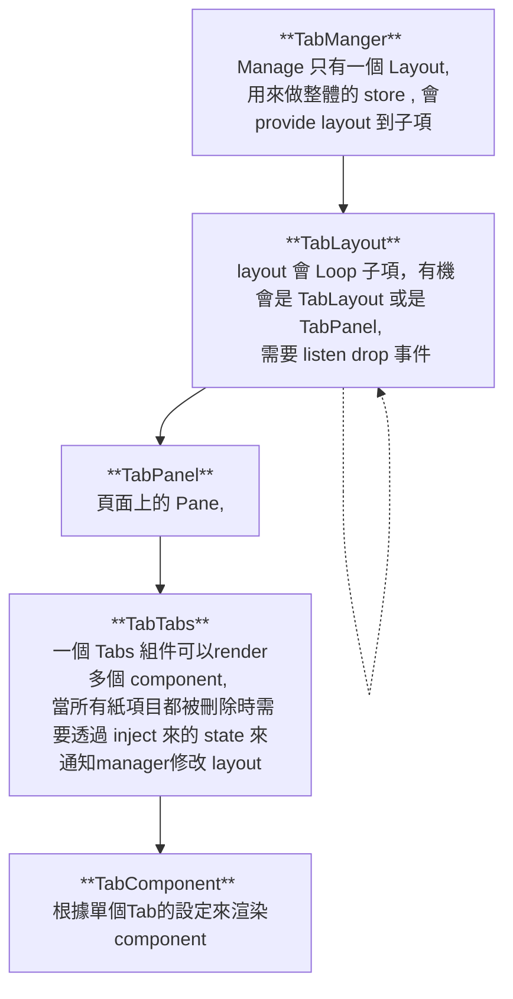

# Tab Manager

this package is to manage multiple tabs

### Tasks
- [x] render multiple splitpanes
- [x] display tab in splitpanes
- [ ] remove tab action ( notify manager if no tabs and change layout)
- [ ] drag and drop tabs between tab
- [ ] drag and drop tabs between layout
- [ ] render custom component in tabpanel
- [ ] test scroll in tab

### Component 結構 



# 留意
Global Component 不能 deconstruct props

這是不可以的
```ts
const { tab} = defineProps<{tab:any}>()
```
只能這樣
```ts
const props = defineProps<{tab:any}>()
```

### Global Component 測試

- [x] provide inject
- [x] api 會不會增加 import 大小 ( 不會，api 只會異部加載)


