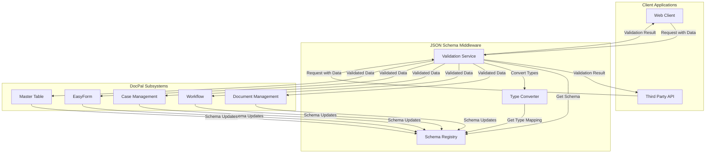
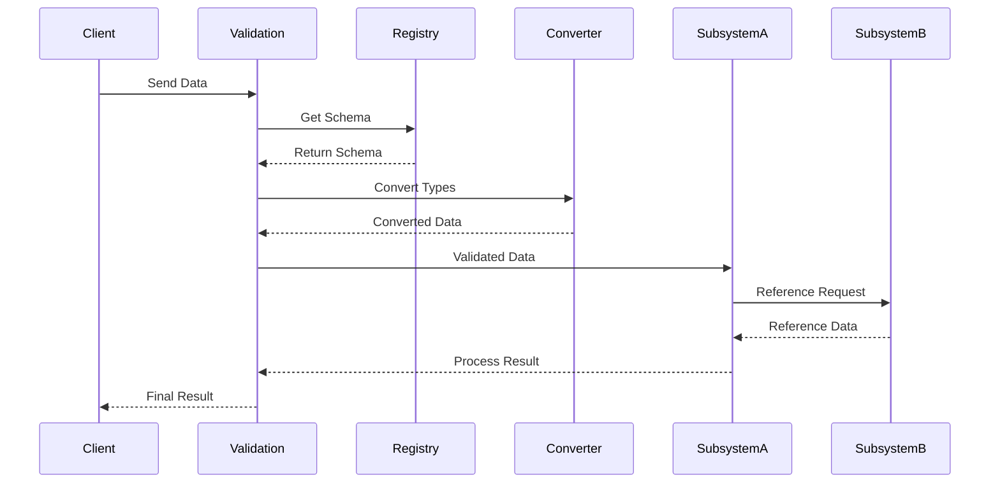

# JSON Schema Middleware System Flow

## Overview
This document describes how the JSON Schema middleware layer facilitates communication and validation between different subsystems in DocPal.

## System Architecture



## Flow Description

### 1. Schema Registration
- Each subsystem registers its data types and schemas with the Schema Registry
- Schemas are versioned and stored centrally
- Type mappings between subsystems are defined
- Reference type relationships are established

### 2. Data Validation Flow
1. **Client Request**
   - Client sends data to the Validation Service
   - Request includes target subsystem and operation type

2. **Schema Retrieval**
   - Validation Service fetches relevant schema from Schema Registry
   - Checks schema version compatibility
   - Retrieves type mapping rules

3. **Type Conversion**
   - Type Converter transforms data to target subsystem format
   - Handles reference type resolution
   - Applies validation rules

4. **Validation**
   - Validates data against schema
   - Checks reference integrity
   - Verifies permissions
   - Returns validation results

5. **Subsystem Processing**
   - Validated data is sent to target subsystem
   - Subsystem processes the data
   - Returns result to client

### 3. Cross-System Communication



## Key Components

### 1. Schema Registry
- Central storage for all JSON schemas
- Version control for schemas
- Type mapping definitions
- Reference type relationships
- Schema validation rules

### 2. Validation Service
- Schema validation
- Type checking
- Reference resolution
- Permission verification
- Error handling

### 3. Type Converter
- Data type conversion
- Format transformation
- Reference type handling
- Cross-system type mapping
- Validation rule application

## Error Handling

### 1. Validation Errors
- Schema validation failures
- Type conversion errors
- Reference resolution failures
- Permission violations

### 2. System Errors
- Schema registry unavailable
- Subsystem communication failures
- Type conversion failures
- Reference resolution timeouts

### 3. Error Response Format
```json
{
  "error": {
    "code": "string",
    "message": "string",
    "details": {
      "validationErrors": [],
      "typeErrors": [],
      "referenceErrors": []
    }
  }
}
```

## Performance Considerations

### 1. Caching
- Schema caching
- Type mapping cache
- Reference resolution cache
- Validation result cache

### 2. Optimization
- Bulk validation
- Parallel processing
- Lazy loading
- Incremental validation

### 3. Monitoring
- Validation performance
- Type conversion metrics
- Reference resolution times
- Error rates
- Cache hit rates 
